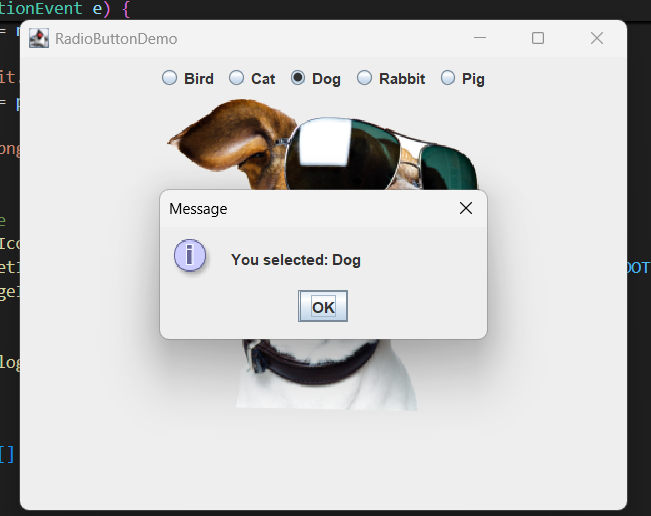

# RadioButtonDemo

This is a simple Java Swing application that demonstrates the use of radio buttons to select and display images of different pets.

## Features
- Five radio buttons: Bird, Cat, Dog, Rabbit, Pig
- Displays a corresponding animal image when a radio button is selected
- Shows a message dialog with the selected animal's name

## How to Run
1. Ensure you have Java installed (JDK 8 or higher).
2. Place the `RadioButtonDemo.java` file and the `images` folder (containing `bird.png`, `cat.png`, `dog.png`, `rabbit.png`, `pig.png`) in the same directory.
3. Open a terminal in the project directory and compile the Java file:
   
   ```bash
   javac RadioButtonDemo.java
   ```
4. Run the application:
   
   ```bash
   java RadioButtonDemo
   ```

## Project Structure
```
RadioButtonDemo.java
images/
    bird.png
    cat.png
    dog.png
    pig.png
    rabbit.png
```
## Screenshots





## Notes
- The images should be in the `images` folder relative to where you run the program.
- The application window will display the selected animal's image and show a message dialog with the animal's name.
